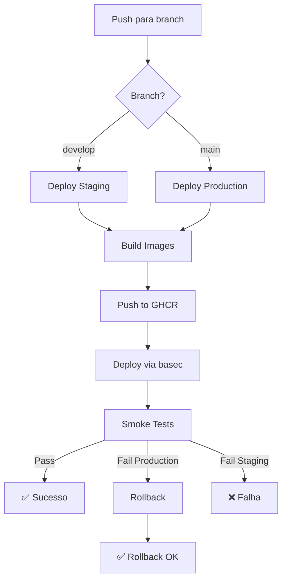

# CI/CD com GitHub Actions

Este documento descreve o pipeline completo de CI/CD do BaseCommerce usando GitHub Actions.

## Visão Geral

O CI/CD do BaseCommerce é implementado através de GitHub Actions workflows que:
- Validam código em Pull Requests (lint, tests, build)
- Fazem deploy automático para staging ao push em `develop`
- Fazem deploy automático para production ao push em `main`
- Usam o CLI `basec` para todas as operações de deploy
- Publicam imagens Docker no GHCR (GitHub Container Registry)

## Estrutura de Workflows

### 1. PR Checks (`.github/workflows/pr.yml`)

**Trigger**: Pull requests para qualquer branch

**Funcionalidades**:
- Setup Python 3.12
- Instala dependências (ruff, black, pytest)
- Executa lint com ruff
- Verifica formatação com black
- Roda testes (construction vertical, integration, CLI)
- Valida build de todas as imagens Docker

**Resultado**: Workflow deve passar antes de merge

### 2. Deploy Staging (`.github/workflows/deploy-staging.yml`)

**Trigger**: Push para branch `develop`

**Funcionalidades**:
- Build e push imagens para GHCR com tags:
  - `ghcr.io/procopio420/basecommerce/<service>:sha-<SHA>`
  - `ghcr.io/procopio420/basecommerce/<service>:latest-staging`
- Deploy via `basec deploy all --env staging --tag sha-<SHA>`
- Smoke tests via `basec smoke --env staging`

**Services buildados**:
- `auth`
- `outbox-relay`
- `engines-worker`
- `construction`

### 3. Deploy Production (`.github/workflows/deploy-production.yml`)

**Trigger**: Push para branch `main`

**Funcionalidades**:
- Build e push imagens para GHCR com tags:
  - `ghcr.io/procopio420/basecommerce/<service>:sha-<SHA>`
  - `ghcr.io/procopio420/basecommerce/<service>:latest-production`
- Deploy via `basec deploy all --env production --tag sha-<SHA>`
- Smoke tests via `basec smoke --env production`
- **Rollback automático** se smoke tests falharem

**Rollback**: Se smoke tests falharem, executa `basec rollback all --env production --to previous`

## Secrets Necessários

Configure os seguintes secrets no GitHub (Settings → Secrets and variables → Actions):

### `DEPLOY_KEY`

Chave SSH privada usada para deploy nos droplets. Deve ter acesso aos droplets de staging e production.

**Como configurar**:
1. Gerar chave SSH (se ainda não existe):
   ```bash
   ssh-keygen -t ed25519 -f infra/deploy_key -N ""
   ```
2. Adicionar chave pública aos droplets:
   ```bash
   ssh-copy-id -i infra/deploy_key.pub root@<droplet-ip>
   ```
3. Copiar conteúdo da chave privada:
   ```bash
   cat infra/deploy_key
   ```
4. Adicionar como secret `DEPLOY_KEY` no GitHub

**Permissões necessárias**:
- Acesso SSH aos droplets
- Permissão para executar `docker compose` nos diretórios remotos

### `GITHUB_TOKEN` (Automático)

O GitHub Actions fornece automaticamente `GITHUB_TOKEN` com permissões para push no GHCR. Se precisar de permissões adicionais, configure em Settings → Actions → General → Workflow permissions.

## Versionamento de Imagens

### Estratégia de Tags

- **SHA**: `sha-<GITHUB_SHA>` - Tag específica por commit (ex: `sha-abc123def`)
- **Environment latest**: `latest-staging`, `latest-production`
- **Futuro**: Tags semânticas (ex: `v1.2.3-staging`)

### Uso no Deploy

- CI/CD sempre usa SHA do commit para deploys automáticos
- CLI pode usar qualquer tag existente no GHCR
- Rollback busca tags anteriores do histórico salvo em `.deploy-history`

## Deploy Manual via Workflow Dispatch

Todos os workflows de deploy suportam execução manual via `workflow_dispatch`.

### Como executar manualmente:

1. Vá para Actions → Deploy Staging (ou Deploy Production)
2. Clique em "Run workflow"
3. Selecione a branch
4. Preencha os inputs:
   - **target**: `all`, `edge`, `platform`, ou `vertical` (default: `all`)
   - **vertical_name**: Nome do vertical (se target é `vertical`, default: `construction`)
   - **tag**: Tag específica (opcional, default: SHA do commit atual)

### Exemplos:

```bash
# Deploy apenas edge no staging com tag específica
# target: edge
# tag: sha-abc123

# Deploy vertical construction no production
# target: vertical
# vertical_name: construction

# Deploy completo com tag customizada
# target: all
# tag: v1.0.0-staging
```

## Como Adicionar Novos Serviços

Para adicionar um novo serviço na build matrix:

### 1. Criar Dockerfile

Crie `apps/<service>/Dockerfile` que funcione com build context da raiz:

```dockerfile
FROM python:3.11-slim
WORKDIR /app
# ... usar paths absolutos a partir da raiz
COPY apps/<service>/src /app/src
COPY packages/basecore /app/packages/basecore
```

### 2. Adicionar na Build Matrix

Edite os workflows de deploy (`deploy-staging.yml` e `deploy-production.yml`):

```yaml
strategy:
  matrix:
    service:
      # ... serviços existentes ...
      - name: meu-servico
        dockerfile: apps/meu-servico/Dockerfile
        context: .
```

### 3. Adicionar no Docker Compose

Adicione o serviço no `docker-compose.yml` apropriado (`edge/`, `platform/`, ou `verticals/<name>/`).

**Importante**: O serviço deve ter `build:` context para que o CLI possa aplicar image tags via `docker-compose.override.yml`.

### 4. Atualizar CLI (se necessário)

Se o serviço precisar de mapeamento especial no CLI, atualize `infra/cli/basec/docker.py` método `set_image_tags()`:

```python
if role == "edge":
    override["services"]["auth"] = {"image": f"{registry}/auth:{tag}"}
    override["services"]["meu-servico"] = {"image": f"{registry}/meu-servico:{tag}"}
```

### 5. Adicionar Smoke Tests

Adicione testes de smoke para o novo serviço em `infra/cli/basec/smoke.py` se necessário.

## Como Adicionar Novos Verticals

Verticals seguem o mesmo processo, mas com algumas diferenças:

### 1. Estrutura

```
apps/verticals/<vertical-name>/
├── Dockerfile
├── src/
├── tests/
└── requirements.txt
```

### 2. Adicionar na Build Matrix

Adicione na seção `service` da matrix:

```yaml
- name: <vertical-name>
  dockerfile: apps/verticals/<vertical-name>/Dockerfile
  context: .
```

### 3. Inventory

Adicione o droplet no `infra/inventory.yaml`:

```yaml
staging:
  vertical_<vertical-name>:
    ip: <ip>
    user: root
    role: vertical
    vertical: <vertical-name>
```

### 4. Docker Compose

Crie `infra/envs/staging/verticals/<vertical-name>/docker-compose.yml` e `infra/envs/production/verticals/<vertical-name>/docker-compose.yml`.

O CLI já suporta verticals dinamicamente através do nome do vertical no droplet config.

## Troubleshooting

### Build falha com "context not found"

**Problema**: Dockerfile usa paths relativos que não funcionam com context da raiz.

**Solução**: Atualizar Dockerfile para usar paths absolutos a partir da raiz:
```dockerfile
# ❌ Errado (context relativo)
COPY src/ /app/src

# ✅ Correto (context raiz)
COPY apps/service/src/ /app/src
```

### Deploy falha com "SSH connection refused"

**Problema**: Deploy key não configurada corretamente ou droplet inacessível.

**Solução**:
1. Verificar que `DEPLOY_KEY` secret está configurado
2. Verificar que chave pública está no droplet (`~/.ssh/authorized_keys`)
3. Verificar conectividade: `ssh -i infra/deploy_key root@<droplet-ip>`
4. Verificar firewall do droplet (porta 22 deve estar aberta)

### Smoke tests falham após deploy

**Problema**: Serviços não estão respondendo corretamente após deploy.

**Solução**:
1. Verificar logs: `basec logs <target> --env <env>`
2. Verificar status: `basec status --env <env>`
3. Em production, rollback automático será executado
4. Investigar logs do container para identificar problema

### Imagens não aparecem no GHCR

**Problema**: Permissões ou autenticação incorreta.

**Solução**:
1. Verificar que `GITHUB_TOKEN` tem permissões de write para packages
2. Verificar que workflow tem `permissions: packages: write`
3. Verificar que repositório está configurado para publicar packages (Settings → Code security and analysis → Dependency graph)

### Rollback não funciona

**Problema**: Histórico de deploy não existe ou está vazio.

**Solução**:
1. Primeiro deploy sempre cria o histórico
2. Rollback manual: `basec rollback all --env production --to <tag-específica>`
3. Verificar histórico: `basec ssh <droplet> "cat /opt/basecommerce/<role>/.deploy-history"`

## Fluxo Completo de Deploy



## Próximos Passos

- [ ] Implementar tags semânticas (v1.2.3)
- [ ] Adicionar notificações (Slack/Email) em caso de falha
- [ ] Implementar blue-green deployment
- [ ] Adicionar health checks mais robustos
- [ ] Implementar deploy canary
- [ ] Adicionar métricas de deploy (tempo, sucesso/falha)

## Referências

- [GitHub Actions Documentation](https://docs.github.com/en/actions)
- [GHCR Documentation](https://docs.github.com/en/packages/working-with-a-github-packages-registry/working-with-the-container-registry)
- [basec CLI Documentation](./infra-cli.md)
- [Docker Buildx Documentation](https://docs.docker.com/buildx/)


